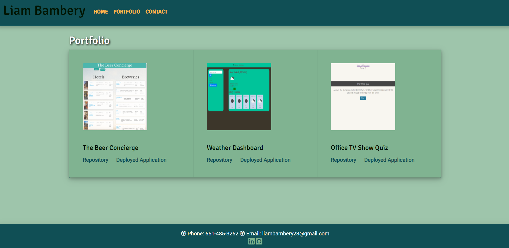

# Portfolio

In this project I constructed a web based portfolio about myself. There are three main pages; Index (which is the home page), Portfolio, and Contact. On the Index page I have included short bio about myself. On the Portfolio page you can find examples of some of the projects I have worked on, including screenshots and links to the applications. On the contact page there is a contact form and links to my LinkedIn and Github accounts. 

## Motivation
The purpose of this project is to showcase my skills as a Full Stack Developer.

## Build status
This project is a work in progress as I work my way through the coding bootcamp I am currently enrolled in.

 
## Screenshots
This project can be viewed at the following url: https://liambambery23.github.io/Portfolio/

## Tech/framework used
Built with Bootstrap: https://getbootstrap.com/

